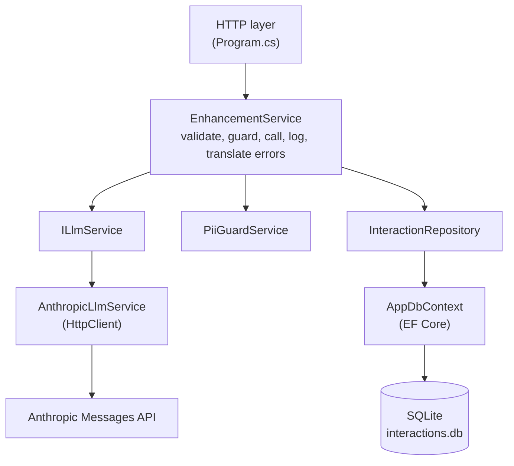
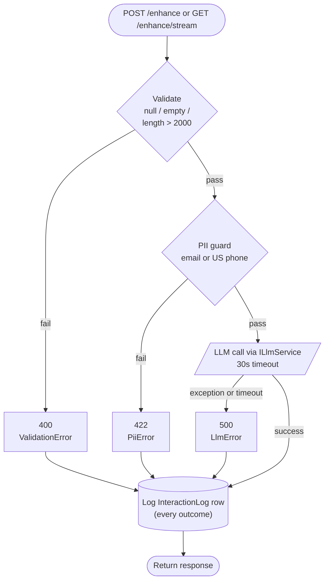

# Granum Assignment -- Notes Enhancement API

A .NET 8 Minimal API that turns raw landscaping technician notes into structured site reports via the Anthropic Messages API. Every request is logged to SQLite with full provenance (model, tokens, latency, outcome), and a static frontend on GitHub Pages exercises the synchronous path; the streaming path is verified locally and ships with documented edge behavior on the live deploy (see Streaming Endpoint section below).

## Quick Start

Prerequisites: .NET 8 SDK, an Anthropic API key, Python 3 (only if you want to re-run the seed).

```bash
cp .env.example .env
# fill in ANTHROPIC_API_KEY
dotnet run --project src/Api/Api.csproj --urls http://localhost:5000
```

The committed `interactions.db` already holds 8 pre-populated records, so `/history` returns data on first boot without an API key.

To rebuild the seed from source:

```bash
python seed/seed.py
```

## Running Tests

```bash
dotnet test
```

17 tests across three fixtures (`EnhancementServiceTests`, `PiiGuardTests`, `HistoryEndpointTests`). Every LLM call is mocked; no network traffic during the test run.

## Architecture

### Layer Separation



The HTTP layer holds no business logic. It deserializes, dispatches to `EnhancementService`, and translates the returned `EnhancementResult` case into the correct status code. Everything that matters lives below the dispatch.

### Request Flow (Failure-First Order)

1. Validate the raw note (null, empty, length > 2000). Fail fast with 400.
2. Run the PII guard (email, US phone regex). Fail fast with 422.
3. Call the LLM through `ILlmService` with a 30-second timeout. Fail with 500 on exception or timeout.
4. Persist an `InteractionLog` row for every outcome, success or failure, with latency and tokens.
5. Return the enhanced text with its provenance.



A bad input never reaches the network. A network failure never corrupts the log.

### The Three Principles

**Failure-First.** Every exit point is explicit. `EnhancementResult` is a discriminated union with four cases (`Success`, `ValidationError`, `PiiError`, `LlmError`) and the HTTP layer switches on the case. There is no silent fallthrough and no "it probably worked." The request flow above is ordered so that the cheapest failure runs first.

**Earn Your Complexity.** `HttpClient` instead of the Anthropic SDK, because one abstraction layer beats two. SQLite instead of Postgres, because the scope does not justify a second process. Minimal API instead of MVC controllers, because the endpoint count is five. Each added abstraction has to pay rent in the form of a concrete problem it solves right now, not a hypothetical one.

**Separate the Responsibilities.** `ILlmService` is the seam between orchestration and vendor API. `PiiGuardService` is stateless and knows nothing about persistence. `InteractionRepository` is the only code that writes to the database. Each class has one reason to change; swapping Anthropic for another provider is a new `ILlmService` implementation, not a rewrite.

## Prompt Engineering Decision

**Decision.** The system prompt lives in `src/Api/Prompts/system_prompt.txt`, is loaded once at startup, and is injected into every Anthropic call.

**Why.** A prompt is a contract with the model, not an implementation detail. Putting it in a versioned file makes it diffable and auditable, and a prompt change becomes a reviewed PR instead of a hot-patch inside a service class.

**Anti-hallucination constraint.** The prompt states five absolute rules, the most important of which is "never invent equipment, measurements, names, or outcomes the technician did not record." A note that says "mowed front" must not come back as "mowed 0.25 acres of front lawn with a 21-inch rotary mower." The rules enumerate what must not be added so the model treats additive content as an error, not a stylistic flourish.

## Technology Decisions

**HttpClient over the Anthropic SDK.** The rejected alternative is the vendor SDK, which wraps the Messages API in a second abstraction layer with its own version-compat surface. With a typed `HttpClient` and a private response record, the JSON contract is visible in one file. Swapping providers means writing one new `ILlmService` implementation, not replacing an SDK.

**SQLite over Postgres.** The rejected alternative is Postgres, which would add a second process to the container, a second connection string, and a second operational surface. The assignment scope is a single-container deployment with a few thousand records at most. SQLite gives me a durable log and a query surface with zero operational overhead.

**Python for the seed script over a C# seed project.** The rejected alternative is another C# executable in the solution. Python standard library `sqlite3` plus JSON is the smaller tool and it does not force the test runner, the API runtime, and the seed runtime to share a build graph. `INSERT OR IGNORE` on a UUID primary key makes the script idempotent.

**ILlmService interface over a direct `AnthropicLlmService` dependency.** The rejected alternative is injecting the concrete class into `EnhancementService`. The interface exists for two reasons: mocking in tests (all 17 tests run with zero network), and swap-readiness if the provider changes. The abstraction earns its rent in both dimensions.

**CORS configured explicitly over `AllowAnyOrigin`.** The rejected alternative is a wildcard that would make the API usable from any page. `ALLOWED_ORIGINS` is an env var with a localhost default for dev; the GitHub Pages origin is added in Railway. CORS is a failure mode that has to be designed for when UI and API live on different hosts, not discovered the first time a browser refuses the request.

## Streaming Endpoint: Documented Edge Behavior

**Decision.** Ship the streaming endpoint with documented edge behavior rather than re-architect around it.

**What works.** GET /enhance/stream returns a valid `text/event-stream` response. The endpoint sends correctly framed SSE events (`data: {...}\n\n`), flushes after every chunk, includes a final `done` event with model and latency metadata, and logs the interaction on completion. The frontend handler parses the stream, renders text into the DOM, and surfaces metrics. Validation and PII rejection take the JSON error path before the stream opens. Local development shows true token-by-token rendering.

**What's degraded.** In the Railway deployment, the visible streaming effect is heavily coalesced. A response that produces ~50-100 individual token deltas from the LLM arrives at the browser as 6-10 larger chunks with ~200ms inter-event gaps. The text is correct and complete. The visual cadence is not.

**Root cause.** Railway routes responses through Fastly (visible on the wire as `x-railway-cdn-edge: fastly/...`). Fastly buffers chunked responses by default and the `X-Accel-Buffering: no` header set by the API is nginx-specific. The coalescing magnitude scales with response length rather than token count, which is the fingerprint of edge write buffering rather than an application-layer issue.

**Why this is documented and not fixed.** The streaming endpoint is a bonus requirement, not a core deliverable. Defeating CDN buffering would require either inflating the stream with keep-alive padding to force flush thresholds, hosting the API somewhere without a buffering edge, or rebuilding the response pipeline with techniques I have not verified work against Fastly. None of those changes serve the assignment's actual goals: clean code, separation of concerns, reliable LLM integration, and complete interaction logging. All four are intact. The visual streaming is an infrastructure constraint surfaced honestly rather than a code defect papered over.

**To verify locally.** Clone the repo, run `dotnet run --project src/Api/Api.csproj --urls http://localhost:5000`, open `docs/index.html` via `python -m http.server 8080` from the docs directory, and use the Stream button in the Assignment tab. The button is hidden on the GitHub Pages deployment for the reason above; locally it renders the stream as the LLM emits it.

**Failure-First in practice.** This is what the principle looks like when applied to a deployment-time discovery. The failure mode (degraded visual streaming) was identified, root-caused, scoped (cosmetic, not functional), and documented in place. The alternative was to spend the remaining build window chasing a CDN workaround instead of finishing the parts of the assignment that are actually graded.

## Demo

- API: https://granum-assignment-production.up.railway.app
- Frontend: https://carmenreed.github.io/Granum-Assignment
- Repo: https://github.com/CarmenReed/Granum-Assignment

## Pre-populated Database

`interactions.db` is committed with 8 records produced by `seed/seed.py`. The mix exercises every outcome the system can produce:

- 4 `success` records (mow and trim, irrigation repair, fall cleanup, tree pruning)
- 2 `llm_failure` records (one HTTP 503 after 3 retries, one 30-second timeout)
- 1 `pii_rejected` record (phone number in the raw note)
- 1 `validation_failure` record (empty raw note)

The `/history` endpoint and the frontend history tab render something meaningful on first load, without an API key ever being set.
