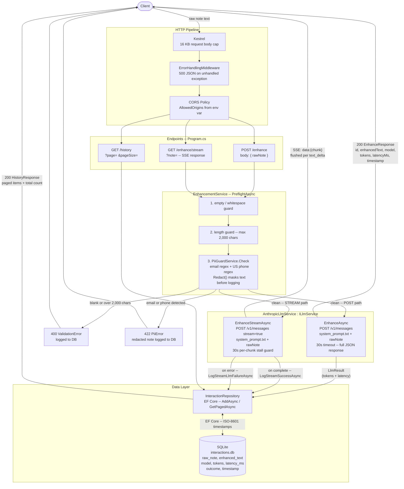

# C# API Layer -- Text Flow



## Layer summary

| Layer | Class | Responsibility |
|---|---|---|
| Entry | Kestrel | Enforces 16 KB body cap before deserialization |
| Middleware | `ErrorHandlingMiddleware` | Catches any unhandled exception -- returns 500 JSON |
| Middleware | CORS | Allows configured origins only |
| Routing | `Program.cs` | Maps endpoints, orchestrates stream path |
| Orchestration | `EnhancementService` | Preflight, LLM call, logging (POST path); preflight + logging helpers (STREAM path) |
| Validation | `PiiGuardService` | Regex scan for email and phone; redacts before any DB write |
| LLM | `AnthropicLlmService` | Builds request with `system_prompt.txt`; calls `api.anthropic.com`; handles sync and SSE modes |
| Persistence | `InteractionRepository` | Writes every interaction (success, validation fail, PII reject, LLM error) to SQLite |
| Database | SQLite (`interactions.db`) | Stores full interaction record including raw note, enhanced text, token usage, latency, outcome |
```
